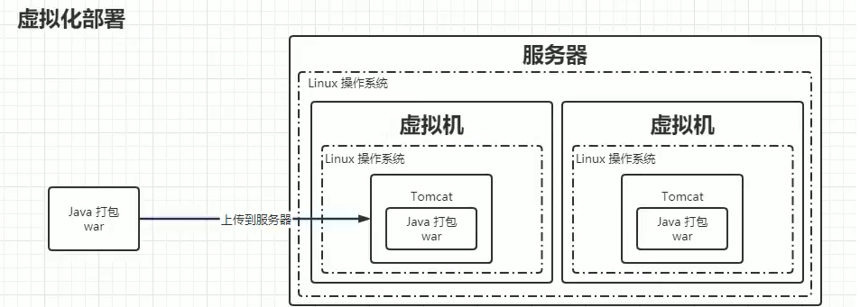

<!--
 * @Author: rooterShip
 * @Date: 2023-09-10 10:50:42
 * @LastEditors: rooterShip
 * @LastEditTime: 2023-09-10 17:51:34
-->
- 容器
  - 容器是虚拟机技术的一种，旨在为运行的程序提供运行环境和依赖，个人理解：开一个容器就类似于新开了一台属于自己的服务器，可以随便乱造且不会影响宿主机。

  - 容器和虚拟机的区别：虚拟机上面覆盖了自己的操作系统，而容器和宿主共用同一个操作系统，所以容器相对于虚拟机而言，既可以提供独立的软件运行环境，占用内存也小，启停速度快，操作更简单，更轻量级。

- 镜像
  - 可以把镜像比作应用程序的安装包，镜像中包含应用程序运行状态所需的所有东西，包括代码，依赖，配置等等，镜像是静态的，镜像需要由容器来运行。
  - 容器里的镜像是可以层层叠加的，比如运行我们的应用程序，需要使用mysql数据库，需要python运行环境，那么容器里只要要有mysql镜像、python镜像、我们自己的应用程序镜像。镜像是静态的，像软件安装包一样，没有运行环境是不可以运行的，那么容器就提供了这样一个运行环境。
  - 容器利用镜像来构建一个运行时环境以此运行一个应用程序。
具体逻辑关系：搭建一个容器想要跑起来某个程序，但是跑这个程序需要一些配置环境，比如java，mysql等环境，这个时候就需要搭建有java和mysql的环境，
在容器内搭建这些环境就需要下载java，mysql的安装包（镜像），这个时候我们把我们自己的应用程序(dockerfile)也打包起来（利用docker build构建应用程序的镜像）。然后
把这三个镜像全部放入容器中并运行即可。Dockerfile->docker build->docker run.
- 部署方式
  - 传统部署
    将java项目打包成war包直接上传到服务器，多个tomcat服务器环境不隔离
    
  - 虚拟化部署
    利用虚拟机，在服务器的操作系统内部新建一个或者多个虚拟机（可以理解为新机器，拥有自己的操作系统，然后在里面部署web服务器(tomcat)并上传war包。），占用资源过度。
    
  - 容器化部署
    利用容器技术，多个容器共用宿主操作系统，但是在容器内依然能实现资源隔绝（文件系统，网络，CPU，内存，磁盘，进程，用户空间等）
    
    容器化部署相比较与传统部署与虚拟化部署方式而言，容器的生命周期大大缩短，容器变得极易被销毁重建，相对应产生的问题是，容器里面隔绝的资源（网络，硬盘等）也会被相应的修改，增加了这些资源的不稳定性，这对于容器内部部署的应用是具有风险的，为此，kubernetes（k8s)技术--容器管理技术，可以进行解决。